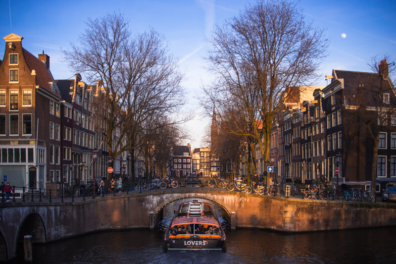
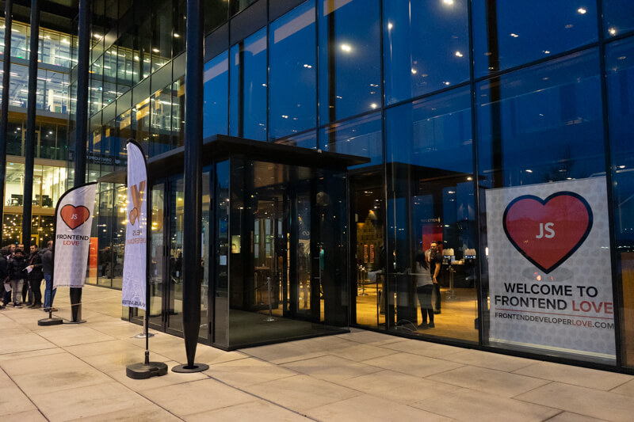
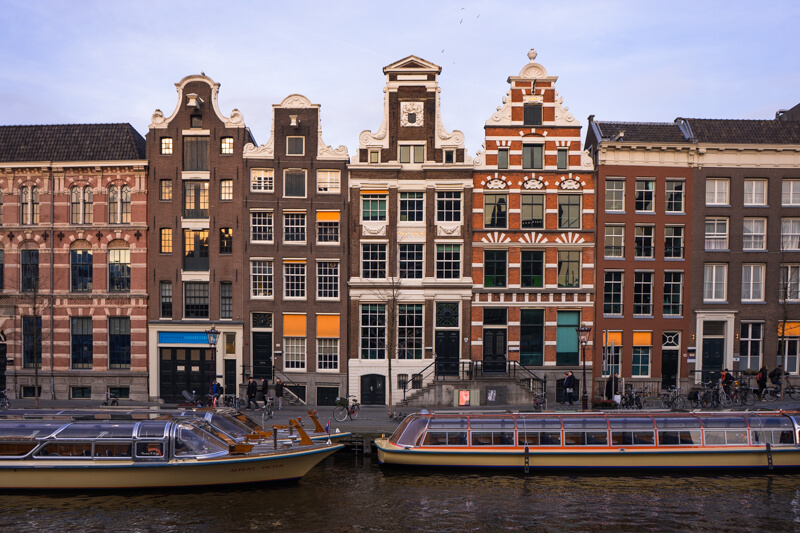
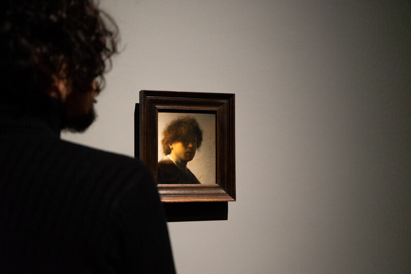
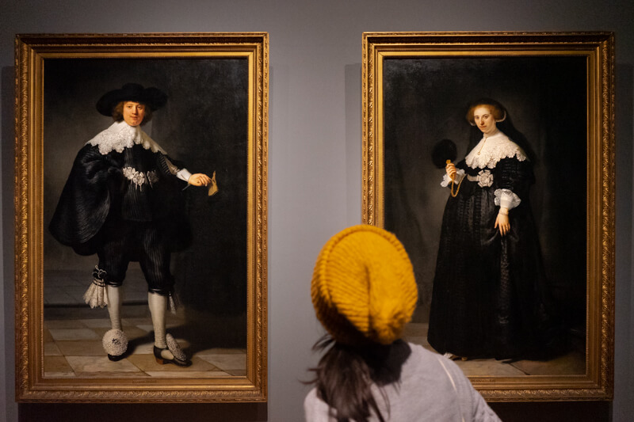
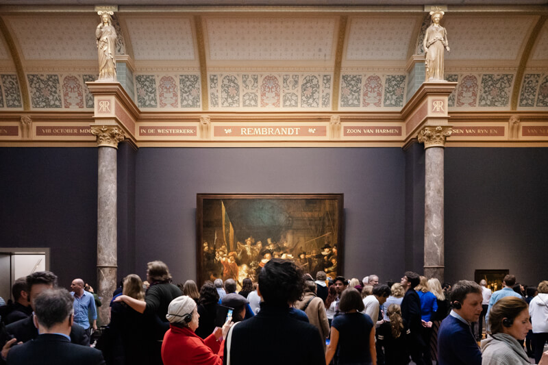
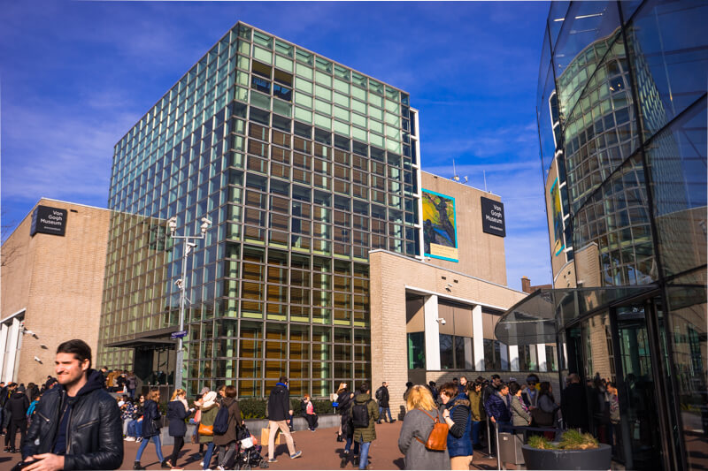
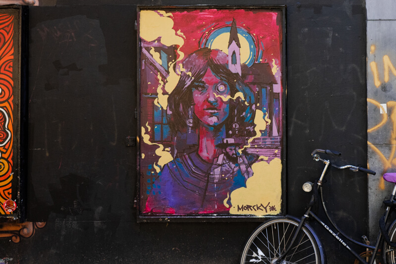
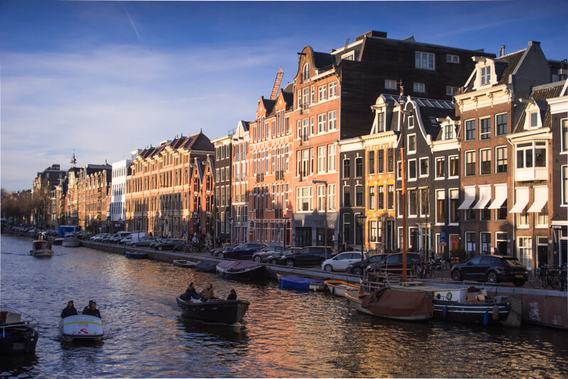
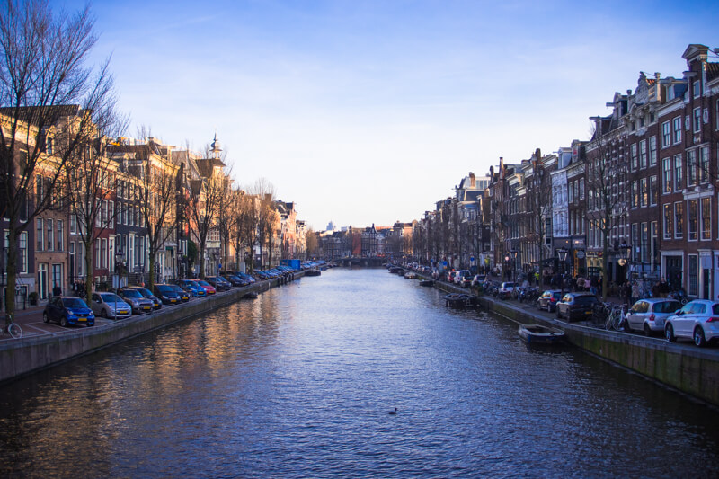

Amsterdam canal

Algunas fotos de mi viaje a Amsterdam del 2019. Muy linda ciudad, las casas son hermosas, todas con un aire un poco romántico y misterioso, pasear de noche y ver las casas, calles y un poco de la vida de las personas fue algo inolvidable.

El motivo inicial del viaje fue para asistir junto a compañeros de trabajo a una conferencia de Desarrollo Front-End y VueJS.

Entrada a la conferencia Front-End Love y VueJS 2019.

Esta era la segunda vez que asistía a un evento similar, y fue bastante impactantante, mucha gente, mucha comida y una producción increíble. La compañia donde trabajaba pagó el costo de mi viaje y el de mis compañeros, por suerte, porque sería imposible asistir por mi cuenta. Sin embargo, tu carrera no va a cambiar por asistir a una de estas conferencias, es una gran experiencia, pero nada que ayude a tu desarrollo profesional, a menos que vayas a hacer conexiones de trabajo (que probablemente sea lo que muchos van a hacer). En mi caso que iba a aprender, los expositores solo introducen ciertos temas, nada es muy profundo y la mayoría son cosas que se pueden ver en blogs o en Twitter.

Después de la conferencia, junto a mi esposa, recorrimos Amsterdam caminando horas y horas a lo largo de los canales, con los planes de conocer galerías de arte, la arquitectura del lugar y probar la comida local.

