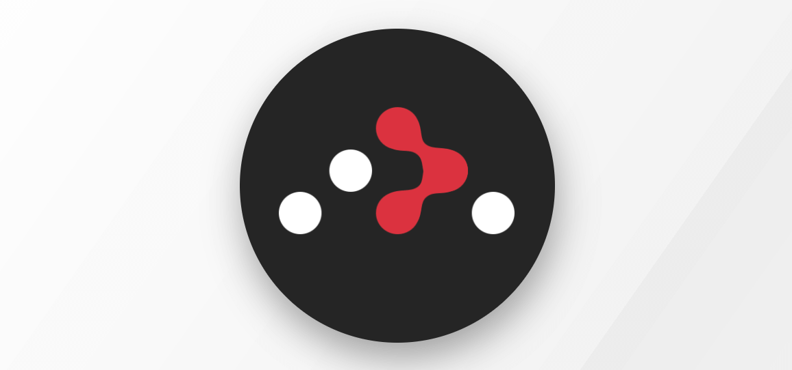
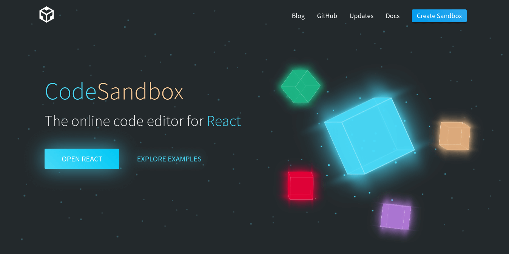
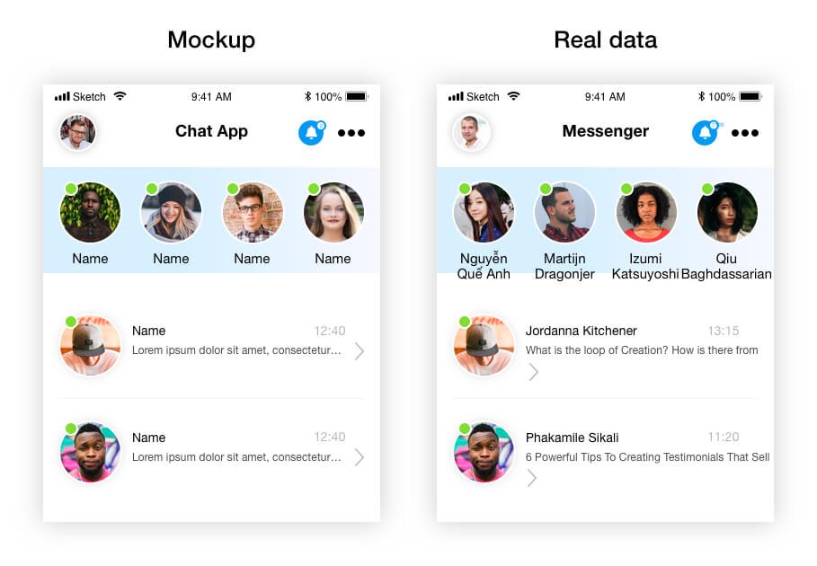

The 5th of October, in Verona, Italy the [**reactjsday**](https://2018.reactjsday.it/) took place, organized by [Grusp](https://www.grusp.org/it/) and [fevr](http://www.fevr.it/), developers from all over the world came together in this lovely city to talk about React. I'll try to share with you the experience of this remarkable event.

[**React**](https://reactjs.org) is a JavaScript library developed by Facebook to create user interfaces for websites and applications, focused mainly on streamlining the development process to put all your efforts in the user experience and usability of the application.

What makes React one of the most popular libraries in the front end development world is the great community that it has. Facebook has done a great job here, integrating really good programmers that actively participate in the development communities , encouraging experimentation, contribution, feedback and support.

This conference was 100% focused on the development of React applications, showing advanced design patterns, best practices, tools and tips to improve performance and usability.

### React Router
#### Michael Jackson
[Twitter](https://twitter.com/mjackson)
[GitHub](https://github.com/mjackson)

The first talk was fantastic, Michael Jackson, co-creator of one of the most used React libraries: [React router](https://github.com/ReactTraining/react-router), showed us, from scratch, how to create react-router. It was incredible to witness, step by step, how to create the foundations of this library. Opening somehow this magic box, which many of us use without knowing what is really doing behind.

[GitHub repository of the talk](https://github.com/mjackson/reactjsday-2018)

### Navigating the hype-driven world of front end development without going crazy
#### Kristijan 'Kitze' Ristovski
[Twitter](https://twitter.com/thekitze)
[GitHub](https://t.co/GM3muDOhfK)

Kitze, in the second talk of the day, spoke of the great moment that we live as developers. He touched some topics like working from anywhere in the world remotely, create products in a couple of days, but mostly of the **FOMO: **fear of missing out. This is the obsession of developers to always move to the latest and greatest tool, language, library, etc. Trying to make our work funnier or trendier, when we should be focused instead, on delivering the best possible experience to our final users. 

### A Reappreciation of Redux: Why my team at PayPal removed Apollo Client and went back to Redux
#### Max Millington
[GitHub](https://github.com/MaxMillington)

Max Millington, a Paypal engineer, talked about how Paypal decided to go back to redux (https://redux.js.org/) after going through Apollo (https://www.apollographql.com/) (both tools to manage the global state of the application). Similar to what Kitze mentioned, Max talked that when adopting new technologies, just because they are new or are the latest, simplicity and comfort are often lost, putting abstractions where many times are not necessary, hindering processes that should be much simpler or just losing time to learn something that does the same as the previous one. They finally realized that it was a mistake and went back to use redux again. Sometimes, less is more.

### Bridging the gap between design prototyping and code
#### Ives Van Hoorne
[Twitter](https://twitter.com/CompuIves)

Another talk I want to highlight is the one of Ives Van Hoorne. He is the creator of codesandbox.io (https://codesandbox.io/), an amazing app that allows you to work with the most popular JavaScript frameworks from your browser, launching a project in seconds.

He explained his current challenge: reduce the friction between design and development. A classic example of this, are designs that show users with really short names, and at the moment of integrating the real data into the app, the design falls short. Because reality is far from the ideal situation that is shown in a mockup.

For this, he proposes to work from the beginning with developed components, integrating real APIs and that each feature or change that is made, is replicated automatically in the application. No need to go to the design software, export assets, send files to the developers, edit CSS, etc.

Here, FramerX (https://framer.com/) takes the lead, being able to integrate React components and design directly on them, in real-time.

[Flex layout example](https://twitter.com/i/status/1048194435295657985)

### Behavioral Programming with React: request, wait and block
#### Luca Matteis
[Twitter](https://twitter.com/lmatteis)
[GitHub](https://github.com/lmatteis)

Another great talk was about Behavioral Programming, by Luca Matteis. A new way of programming that seeks to integrate new features to an app based on events or "scenarios" that the user performs. Adding pieces of code on top of a defined path or "thread", it's possible to change the behaviour of a existing feature without changing the actual code already written. Really interesting.

Links:
https://medium.freecodecamp.org/an-intro-to-behavioral-programming-with-react-request-wait-and-block-ad876e2d235e

Is worth mentioning [React Advanced Patterns by Manjula Dube](https://github.com/manjula91/react-advanced-patterns), a quick look into the predominant patterns of React, and also [GraphQL](https://graphql.org/learn/), the standard APIs query language for React apps.

The conference was perfect, with space to share ideas, ask questions to the speakers, 5 minute improvised lighting talks by the same assistants and breaks to meet the amazing community of developers, making this event an incredible opportunity.

Recap video: https://twitter.com/i/status/1060548897205088257

**Many thanks to Sorint.lab for the invitation!**

P.S. If you're really into React, take a look into the latest feature they released: (Hooks)[https://reactjs.org/docs/hooks-intro.html]. No FOMO at all 😂

[*Cover photo by Alessio Lin on Unsplash*](https://unsplash.com/photos/h52tu2WIrkw)
