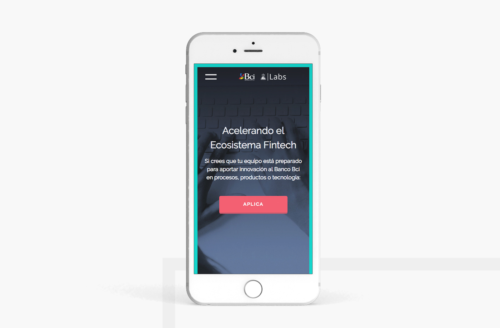

BCI  LABS

Bci Labs is the corporate accelerator of the Chilean bank: Bci, its goal is to identify and access opportunities of innovation from the FINTECH (LATAM) ecosystem. With this objective, a 12-week acceleration program has been developed to accelerate the integration of selected startups into the bank, so as to complement the value proposition for its clients.

It was necessary to create a landing page to briefly explain what Bci Labs does. A clean proposal was designed, where the main target is that the user apply with the form. For that reason, the "call to action" button is permanently present and clearly visible in the website.

The design is fully responsive and done with a mobile-first approach.

