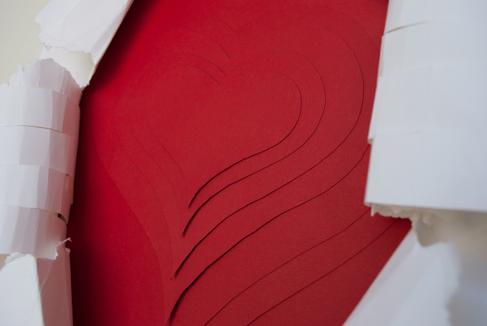
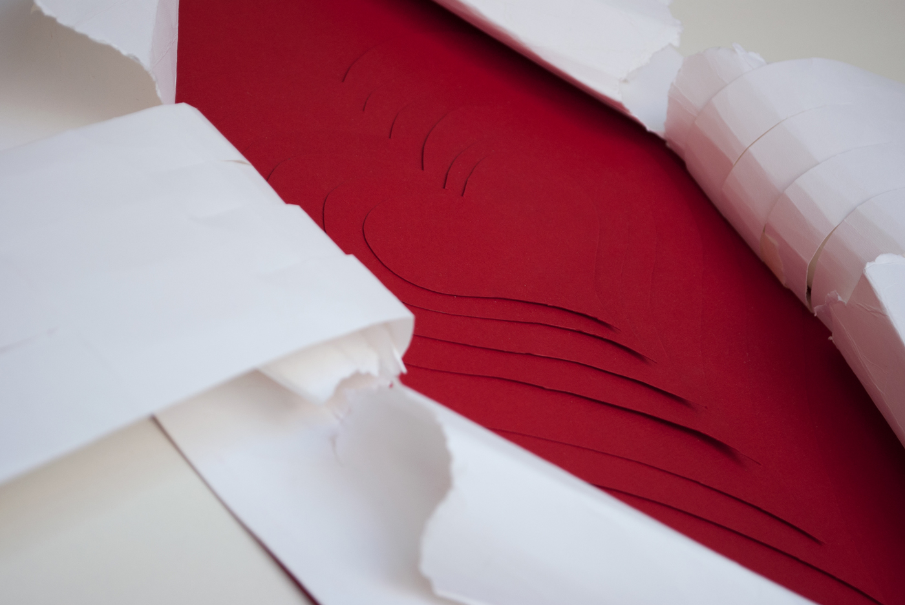

Second version of the competition organized by Antalis-GMS and the INACAP Apoquindo Graphic Design school, aimed at students from universities and institutes throughout Chile. The purpose of this call was to visually reinterpret the destiny, use or role of the paper, incorporating concepts of innovation and sustainability.

The concept used to solve the problem was "Hero".

The Design discipline needs strength and passion to effectively communicate the message. Making reference to Clark Kent's "transformation" into Superman, the paper hands tear the paper to show us his red interior, with hearts at different levels representing the designer's deeply love for his work.

"The important thing in Life is not triumph, but the struggle."
– Pierre de Coubertin

The poster won the first prize in the contest.

