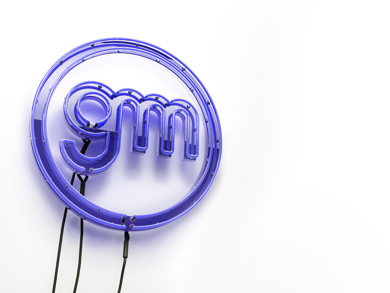

Este es mi logotipo 3D en neón hecho con Cinema4D.
Proyecto personal para aprender algunas técnicas de Cinema 4D, es una luz de neón de mi propio logo. Gracias a [Rizon Parein](https://www.behance.net/rizon) por la GRAN inspiración para este trabajo. 

Míralo en [dribbble](https://dribbble.com/shots/3763631-Hi-dribbble) and [Behance](https://www.behance.net/gallery/17188905/3D-Neon-Sign)

