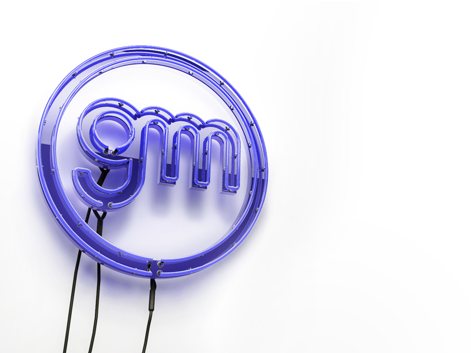

Personal project to learn some techniques in Cinema 4D, it's a neon sign of my own logo. Thanks to [Rizon Parein](https://www.behance.net/rizon) for the BIG inspiration on this project. 

Check the shot on [dribbble](https://dribbble.com/shots/3763631-Hi-dribbble) and [Behance](https://www.behance.net/gallery/17188905/3D-Neon-Sign)

