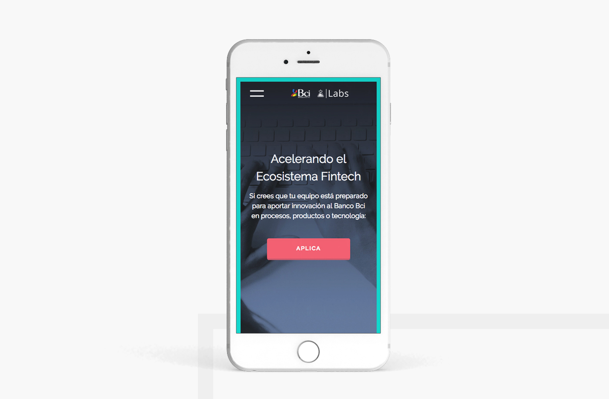

Bci Labs es la aceleradora corporativa de Bci, su objetivo es identificar y acceder a oportunidades de innovación del ecosistema FINTECH (LATAM). Con este objetivo se ha desarrollado un programa de aceleración de 12 semanas, cuyo objetivo es agilizar la integración de las startups seleccionadas al banco, de forma que complementen la propuesta de valor de cara a sus clientes.

Se necesitaba crear una landing page para explicar resumidamente lo que hace Bci Labs. Se diseñó una propuesta muy simple, donde el objetivo principal es que el usuario vaya al formulario de postulación. Por esa razón, el "call to action" botón está siempre presente y visible en el sitio.

Se realizó el diseño y el desarrollo web del sitio. El diseño es responsive, usando el método mobile-first.

