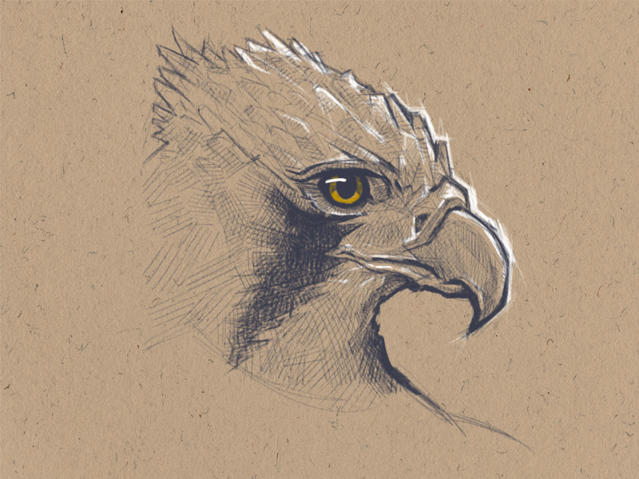
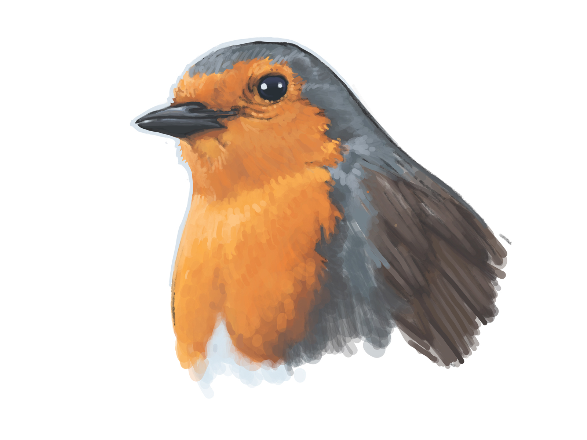
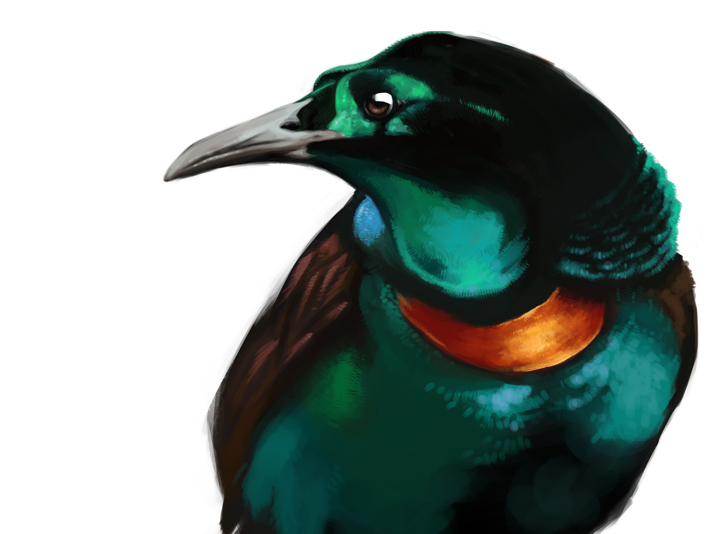
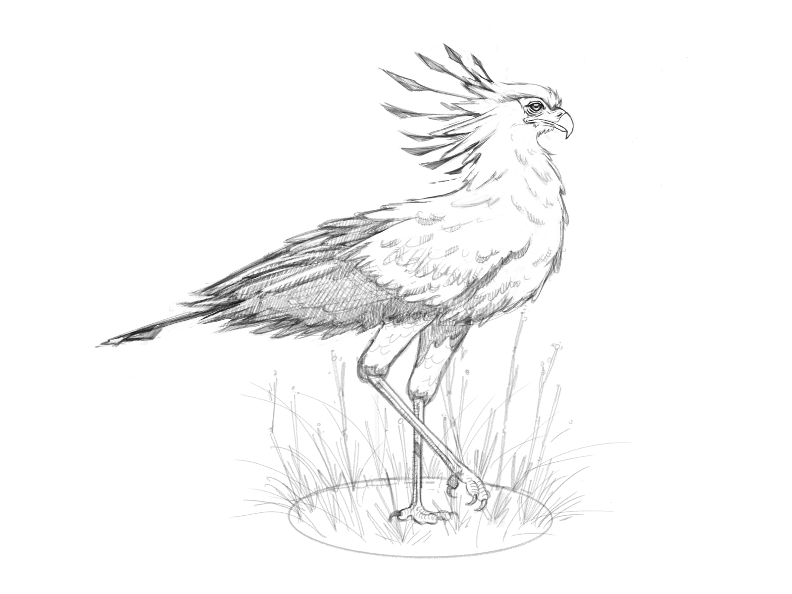
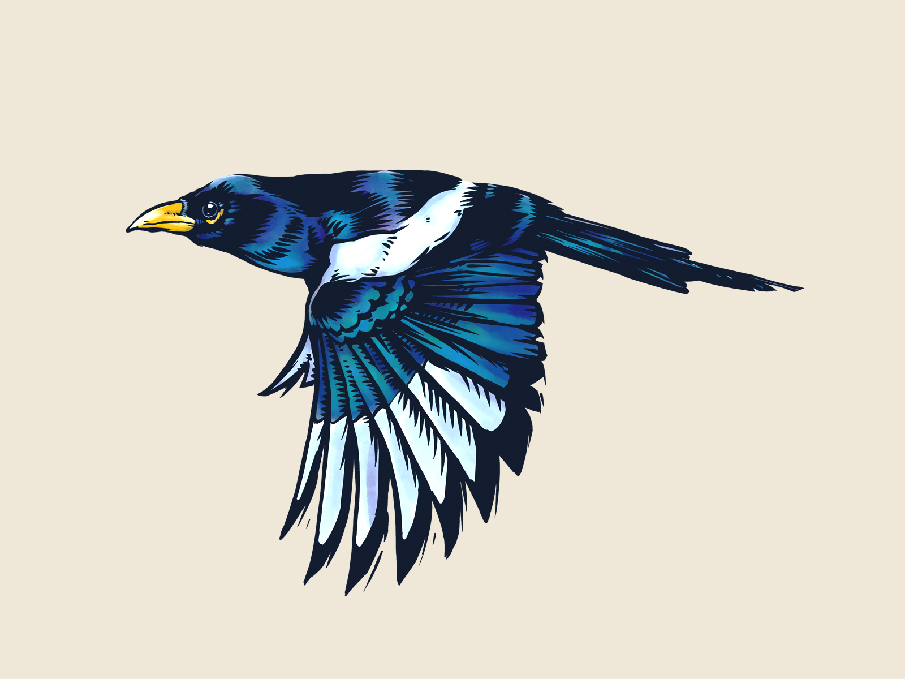

Sketch of a Blue-black Grassquit bird done in Procreate, using the ink and gouache brushes.

I'm trying to study birds using different techniques, to be able to represent in the best way possible the feathers, textures, shapes and colours.

Quick sketch of a bird.

Quick digital sketch of a Robin bird made on Procreate with an iPad pro.

Digital painting of a Bird of Paradise, Splendid Astrapia.

Preparatory sketch for digital painting of a Secretary Bird. Drawn on Procreate.

Yellow-billed Magpie ink sketch done with Procreate.

I'll keep studying and practising with the feathers and subtle textures of these beautiful birds.