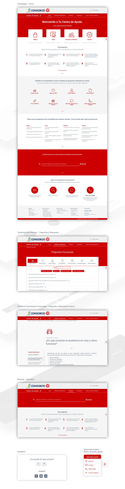
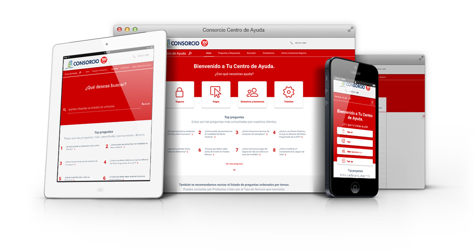

Consorcio es una empresa chilena que dispone a sus clientes de una amplia gama de seguros de auto, hogar, accidentes personales y comerciales. Buscando entregar una respuesta eficiente a las dudas de sus usuarios, se dispuso a crear el Centro de Ayuda Consorcio.

Centro de Ayuda Consorcio quiere hacerle la vida más fácil a sus usuarios, mostrando y categorizando las preguntas más buscadas, todo hecho de la forma más sencilla posible. Además funciona como un medio de contacto rápido y eficiente para quienes lo visiten.

Se realizó el diseño y desarrollo front-end del sitio, consistiendo en las páginas de Inicio, Preguntas y Respuestas (junto a los interiores de éstas) y el Buscador. El sitio es totalmente responsive, construido con el framework Bootstrap 3.

