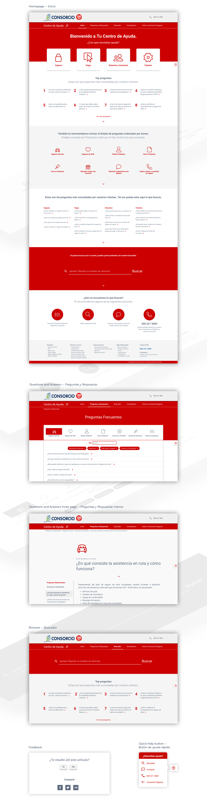

Consorcio is a company from Chile that offers to its customers a wide range of auto, home, personal and commercial insurance. Looking to deliver an efficient response to the frequently asked questions from the users, the company create the Consorcio Help Center.

The Consorcio Help Center wants to make the life easier for every single user, displaying and categorising the most asked questions, in the simplest and cleanest way possible. It works as a fast contact method for the visitors as well.

The website consists of a Homepage, Questions and Answers page and another page of a very simple and helpful Browser. The site is responsive built with Bootstrap 3.
