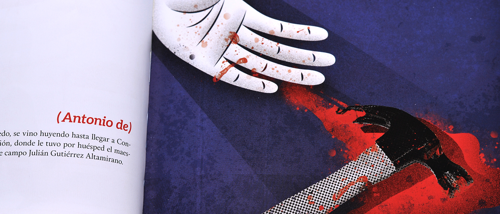

##Proyecto académico que constó en la reinterpretación por medio del diseño editorial e ilustración del Diccionario Biográfico Colonial de Chile, escrito en 1906 por el historiador José Toribio Medina. El diccionario es un compendio de reseña biográfica de gobernantes, soldados, sacerdotes, escritores, entre otros personajes que poblaron el territorio chileno durante el período colonial.

El diccionario es un compendio de detalles biográficos de gobernantes, soldados, sacerdotes, escritores, entre otros personajes que poblaron el territorio chileno durante el período colonial.

Cada alumno tuvo que ilustrar 6 personajes usando la pequeña biografía como inspiración. El profesor nos dio un referente visual con el cual trabajar para mantener un estilo consistente a lo largo del libro. Eligió a Agata Dudek. Además, cada uno debió encargarse del diseño editorial del libro.

##Mi diseño (layout) y 4 de mis ilustraciones fueron escogidos para la versión final del libro.

_La portada del libro fue diseñada por Gloria Ñanculeo: https://www.behance.net/gnanculeo_

El libro fue seleccionado para la muestra final de estudiantes en la categoría "Gráfico y Comunicación Visual" el Sexto Encuentro de la Bienal Iberoamericana de Diseño (BID) de España.

El link del proyecto en el sitio de la bienal: https://goo.gl/RhwqjF

_Detalles de la Impresión del libro:
Tapa blanda. 17 x 13 cm.
84 páginas impresas a 4 colores
500 libros impresos y distribuidos gratuitamente
El texto original es de Dominio Público: http://www.memoriachilena.cl/602/w3-article-8209.html_
