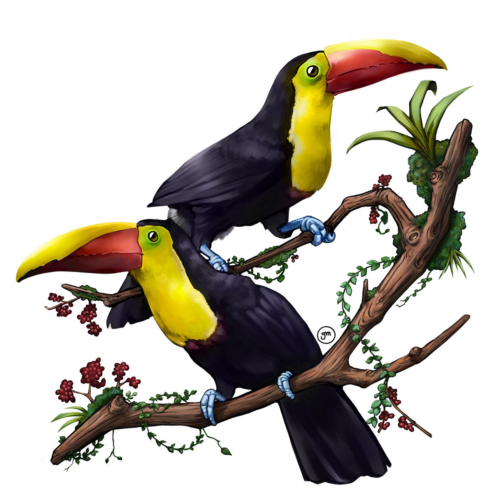
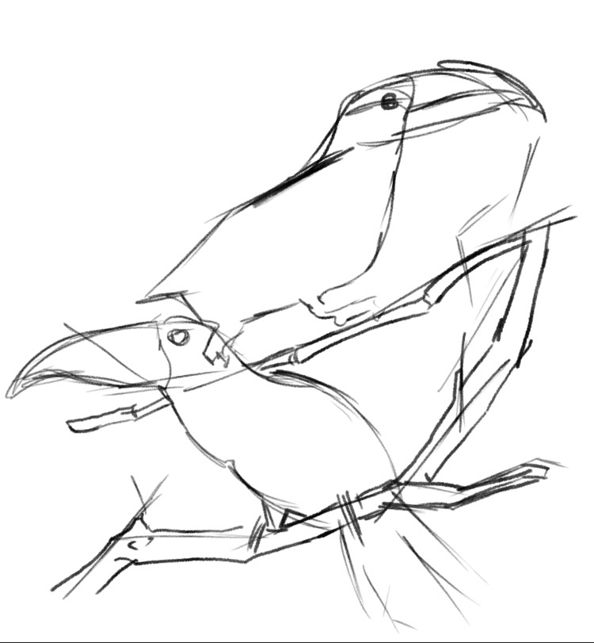
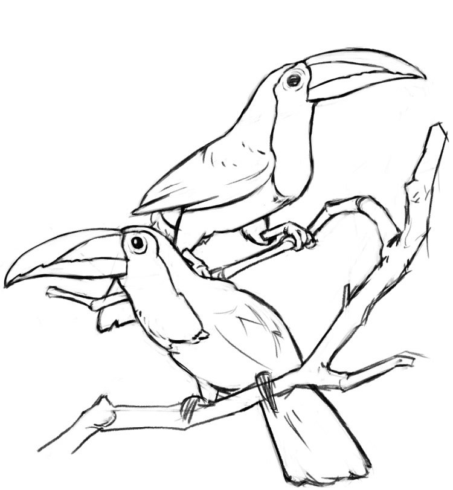
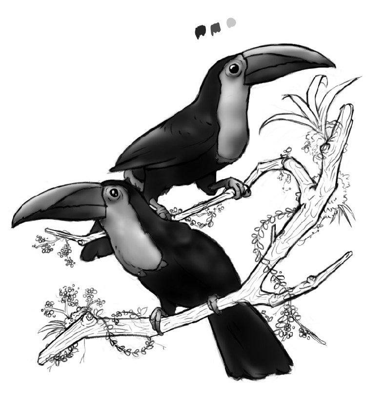
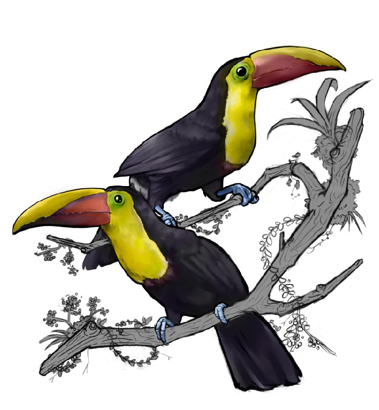
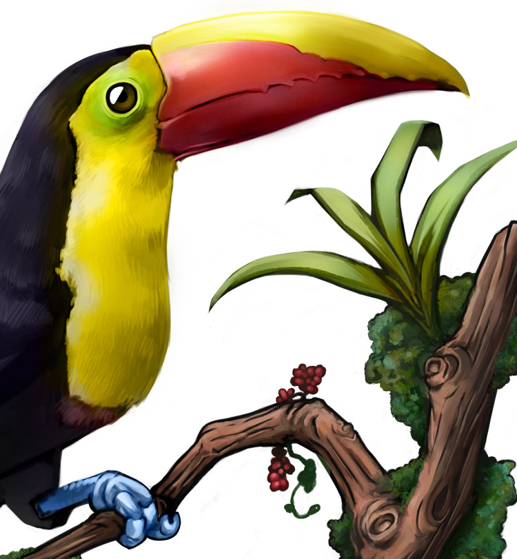
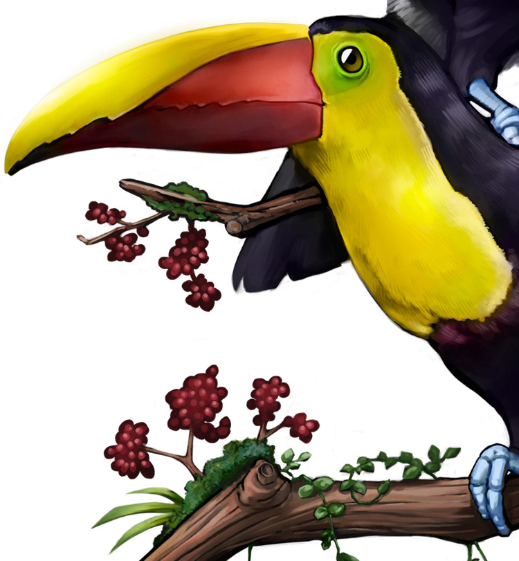

Digital painting of two Yellow-throated Toucans.
These birds, also known as black-mandibled or yellow-breasted toucans, are found in Central and northern South America.​​​​​​​

## Process

Toucans painting finished

Initial sketch of the illustration

Finished lines of the drawing

For me it's kind of hard seeing the light and shadow values of a picture. So to make it a bit easier, I started with only grayscale tones.

sketch-grayscale

Then I just paint flat tones on a different layer with the "color" mode on Photoshop. To avoid the "unsaturared" colors, I then add several layers of colors to improve and highlight certain areas of the painting, using the layer modes, like overlay or multiply and playing with the curves and levels of the image.

Basic rendering of the Toucans and starting the branches with a flat gray color

## Some details of the illustration

Textures from birds are always difficult to paint. I used a hard brush doing short strokes for the plumage and a soft brush for the beak.

