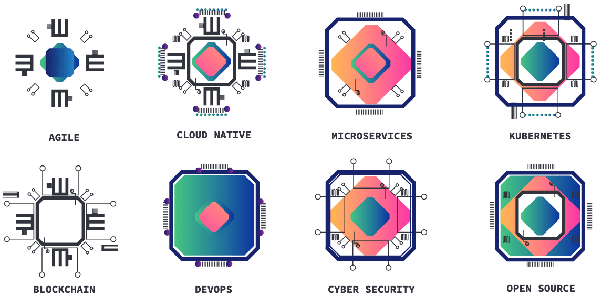
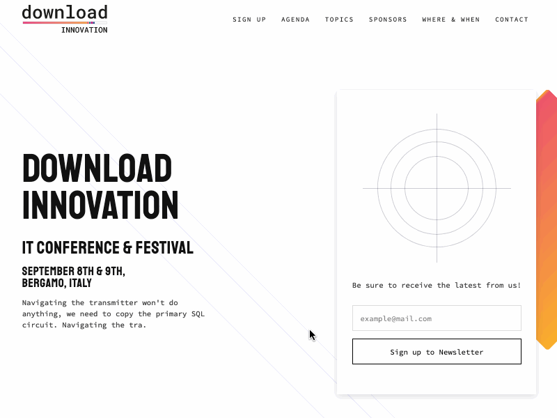
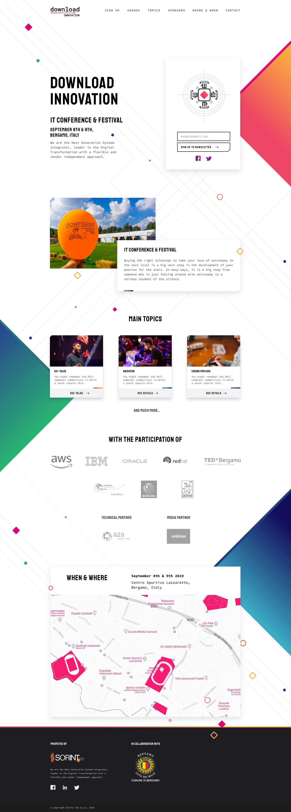

Diseño UX/UI y Desarrollo Web para el sitio del evento Download Innovation 2019. Este evento es organizado por <a href="https://www.sorint.it/" rel="noopener" rel="noreferrer" target="_blank">Sorint.lab</a>, empresa de tecnología de Bergamo, Italia.

El diseño se inspiró en los conceptos de <a href="https://es.wikipedia.org/wiki/Arte_generativo" rel="noopener" rel="noreferrer">Arte Generativo</a> e Innovación Tecnológica a través de la Creatividad. Destaco el desarrollo de un "chip" generado cuando los usuarios escriben su email para registrarse al evento. Los símbolos fueron diseñados por Beatrice Bramati.

Concepto y Diseño de chips por Beatrice Bramati.

Puedes revisar el sitio aquí: https://download-innovation-2019.netlify.com y el sitio oficial acá: https://download-event.io/en/

