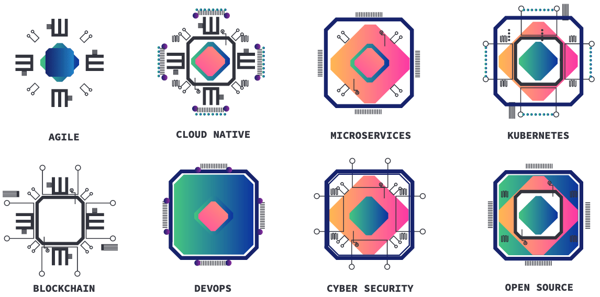

UX/UI Design and Web Development for the Download Innovation 2019 event website. This event is organised by <a href="https://www.sorint.it/" rel="noopener" rel="noreferrer" target="_blank">Sorint.lab</a>, an Italian technology company from Bergamo, Italy.

The design was inspired by the concepts of <a href="https://en.wikipedia.org/wiki/Generative_art" rel="noopener" rel="noreferrer">Generative Art</a> and Technology Innovation through Creativity. I also developed a "chip" symbol, generated by the email of the users, at the moment of the event subscription. The symbols were designed by Beatrice Bramati.

Chips Concept and Design by Beatrice Bramati.

You can see it here: https://download-innovation-2019.netlify.com and this is the official website: https://download-event.io/en/

