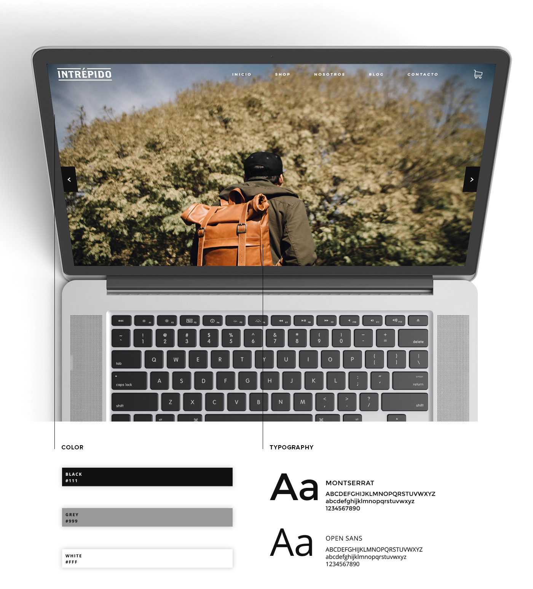
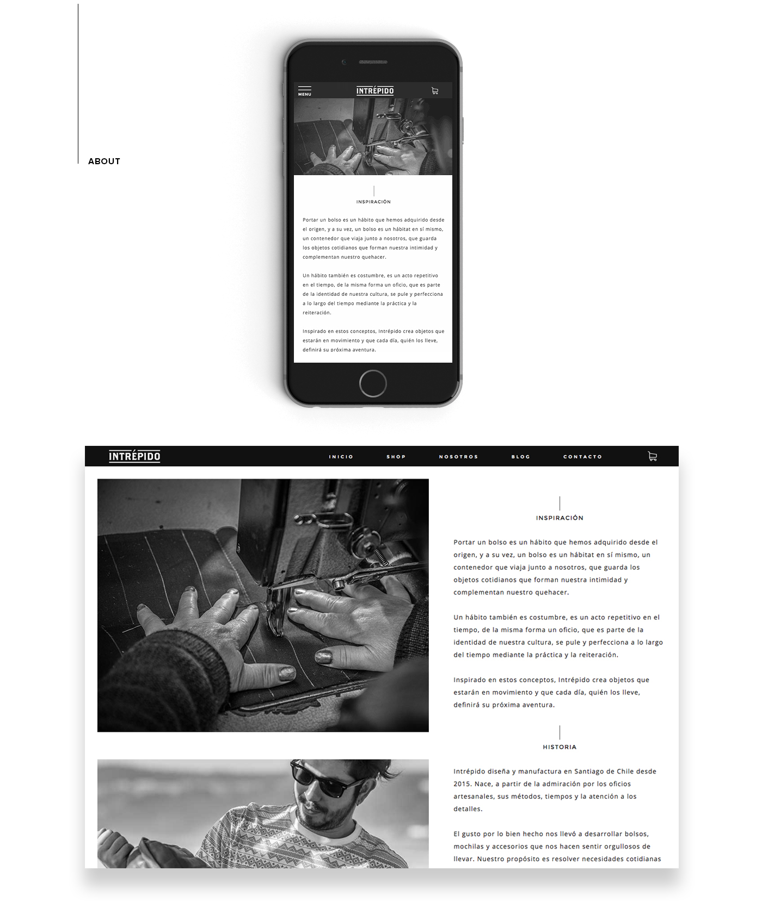
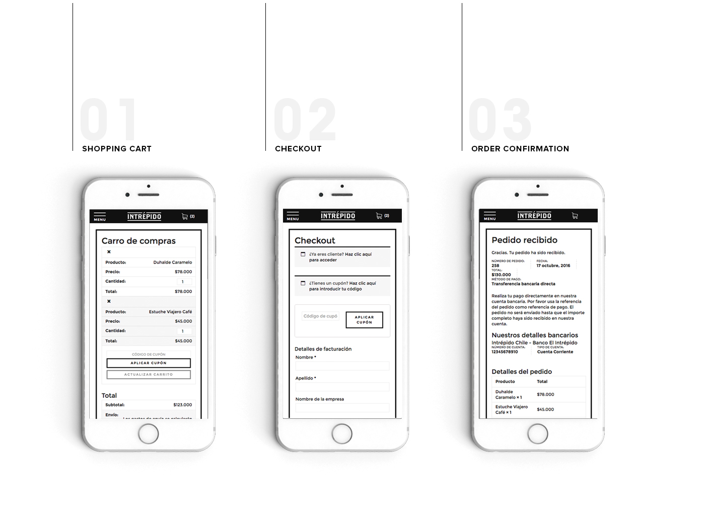
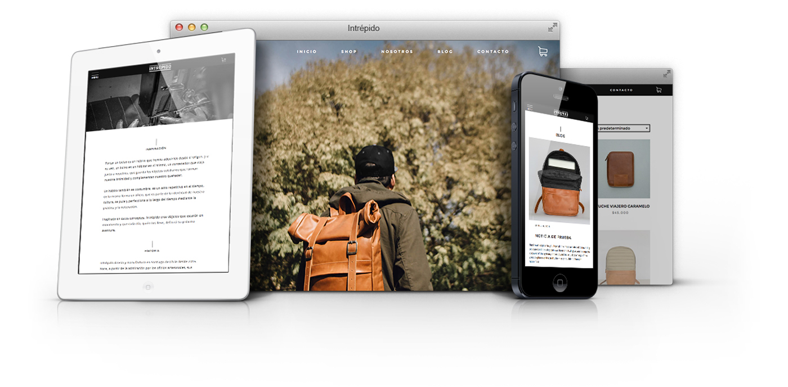

Intrépido designs and manufactures in Santiago, Chile from 2015. Born, from admiration for crafts, methods, times and attention to detail. Intrépido makes bags, backpacks and accessories. Its purpose is to solve everyday contemporary needs and create handmade products, which mixes new ideas with the traditional techniques, machinery and crafts.

