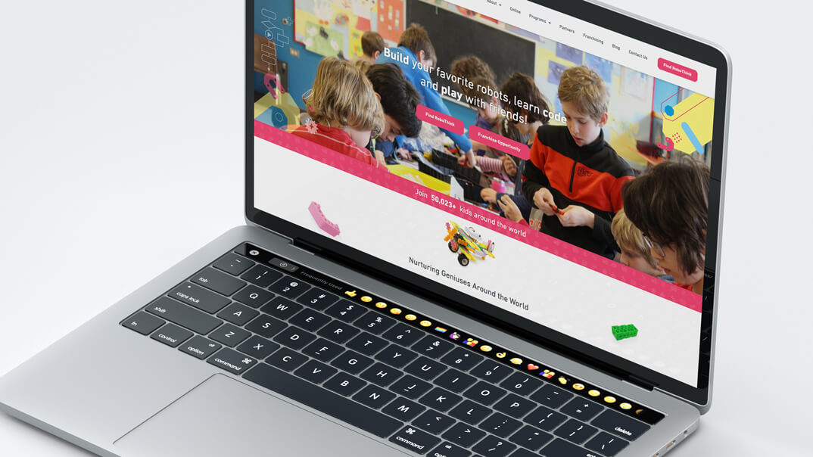
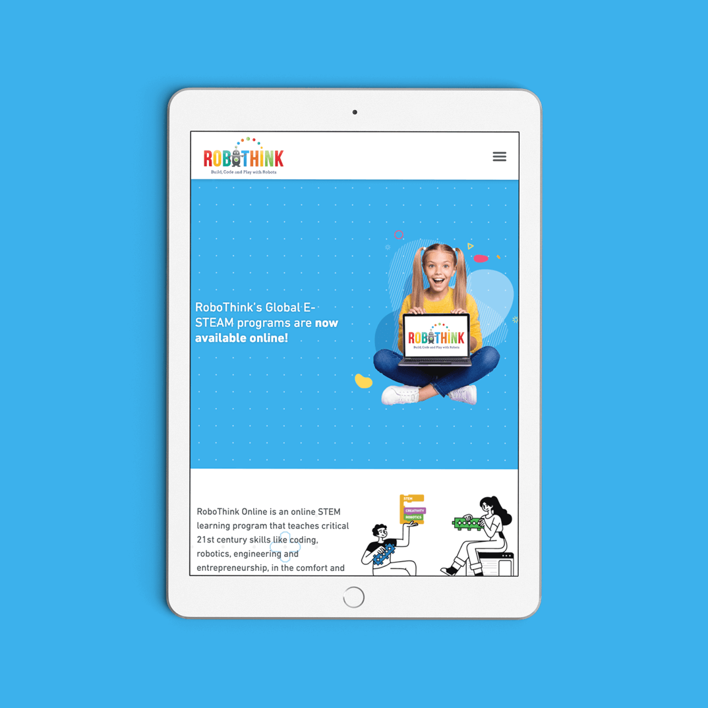
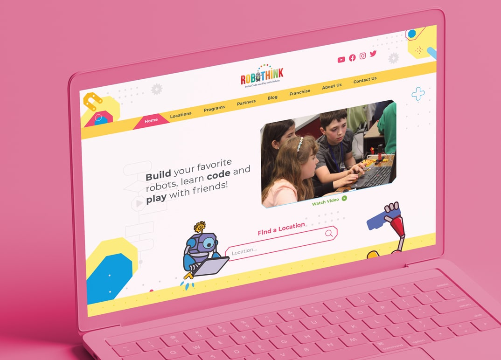

RoboThink es la principal franquicia de educación STEM del mundo. Construí un sitio web totalmente personalizado con WordPress y Elementor. Algunas de las características incluidas son una página de localizaciones administrable con búsqueda AJAX e integración de OpenStreetMaps, animaciones de desplazamiento, custom post types, múltiples formularios para la generación de leads, SEO, optimización para la indexación de Google y optimización del rendimiento.

El proyecto también incluyó la implementación de plugins como ACF (Advanced Custom Fields), Yoast SEO, Google Analytics y otros.

