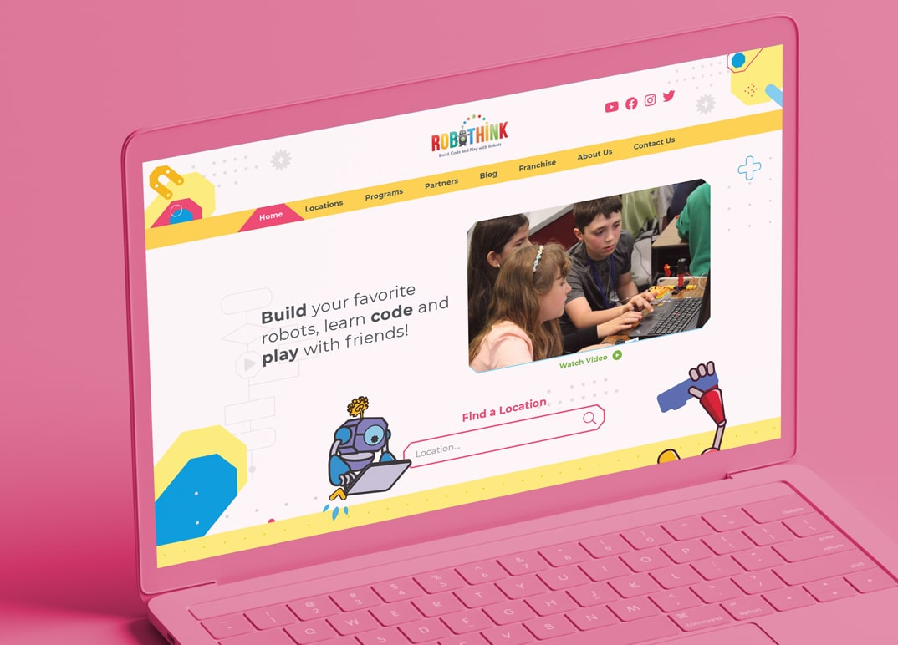

RoboThink è il leader mondiale di STEM edu-franchise. Ho costruito un sito web completamente personalizzato con WordPress e Elementor. Alcune delle caratteristiche incluse sono una pagina di localizzazione con ricerca tramite l'integrazione di AJAX e OpenStreetMaps, animazioni di movimento e scorrimento, custom post types, multipli forms per la generazione di leads, SEO, ottimizzazione per l'indicizzazione di Google e performance.

Il progetto ha incluso anche l'implementazione di plugin come ACF (Advanced Custom Fields), Yoast SEO, Google Analytics e altri.

