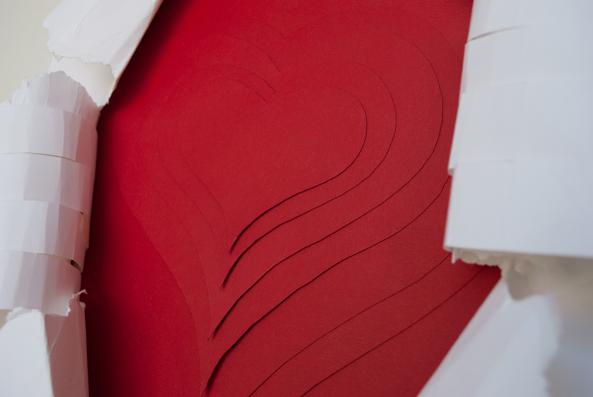
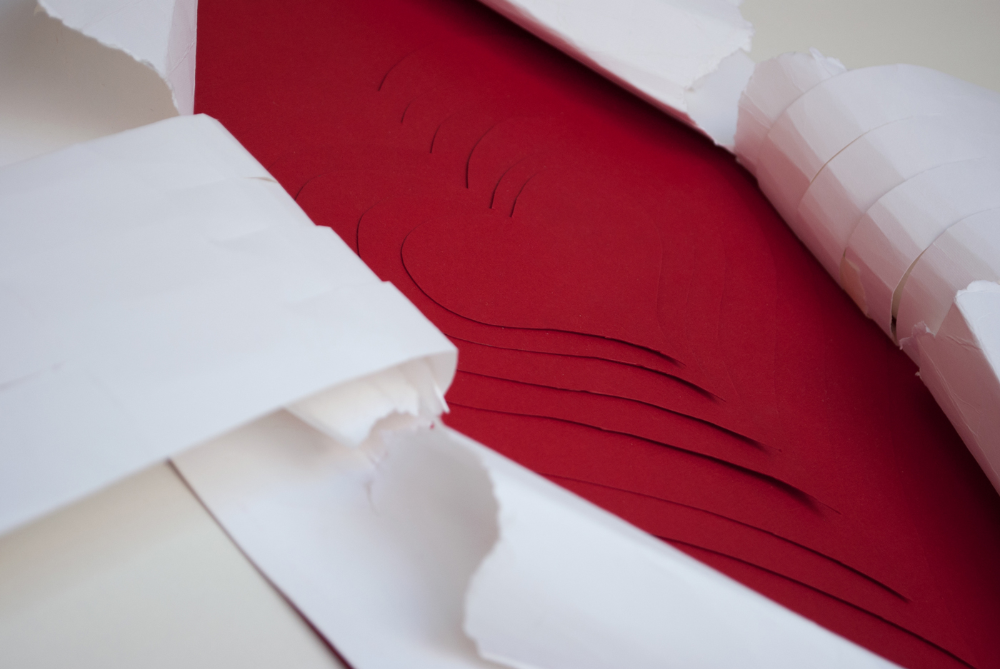
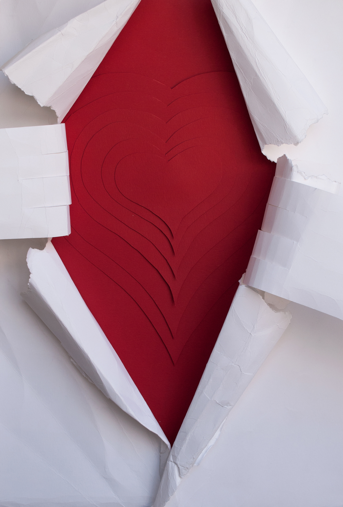
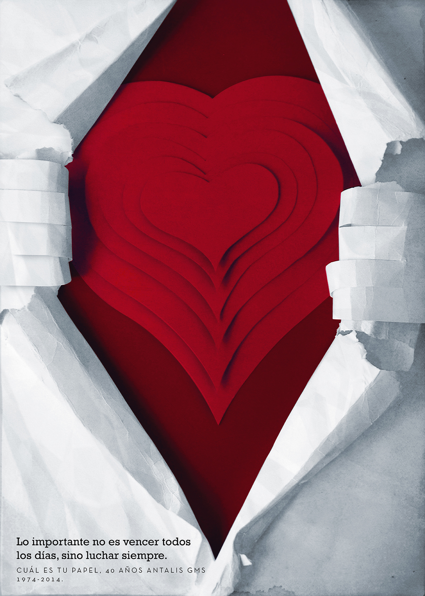

Segunda versión del concurso organizado por Antalis-GMS y la carrera de Diseño Gráfico de INACAP Apoquindo, dirigido a estudiantes de universidades e institutos de todo Chile. El propósito de esta convocatoria fue reinterpretar de manera visual el destino, uso o rol de un papel, incorporando conceptos de innovación y sustentabilidad.

Para resolver el encargo, se trabajó con el concepto de "Héroe".

La disciplina del diseño necesita de la fuerza y pasión para comunicar efectivamente el mensaje. Haciendo la referencia a Clark Kent al "transformarse" en Superman, las manos rasgan el papel para mostrar su interior rojo, con corazones en distintos niveles representando el profundo amor de un diseñador por su trabajo.

"Lo importante en la vida no es el triunfo, sino la lucha."
– Pierre de Coubertin

El afiche ganó el primer premio en el concurso.
