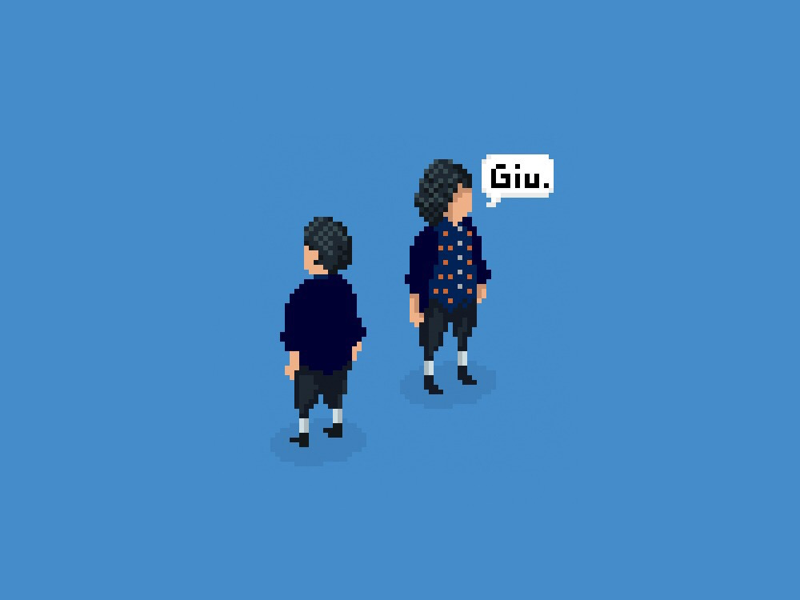
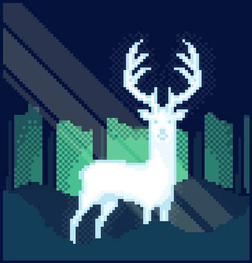
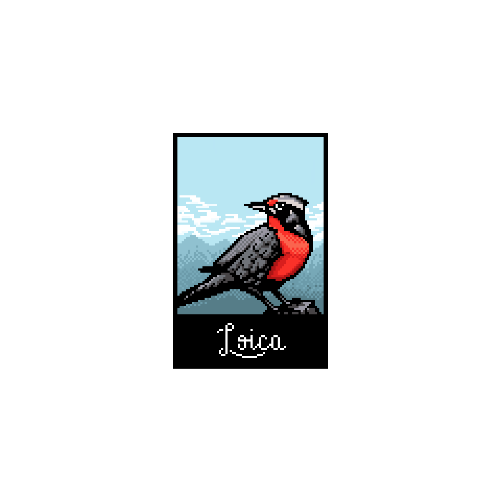
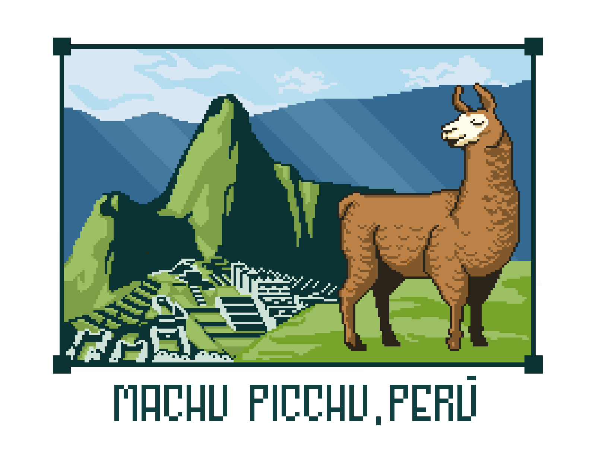
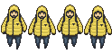

These are some of my pixel art illustrations I made. One thing I really love of Pixel Art is how easily you can pass from an idea to finished product. The simplicity of the pixels is fascinating.

This was my first experiment. A little character of myself.

A little gif animation of a deer moving some starry pixels.

Loica, a bird that lives in Chile and Argentina. I love birds 🦜!

I done this Llama after my trip to Machu Picchu, Peru. I got really inspired with the magical vibes of this wonderful place.

This is a sprite done in Aseprite, while I was learning Unity. This was the main character of my game.
