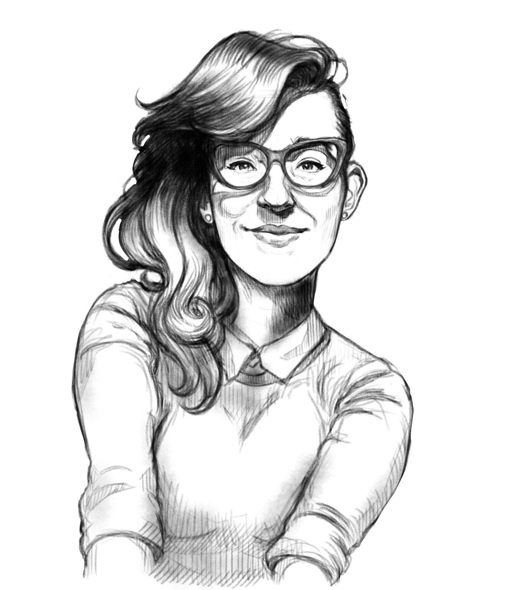
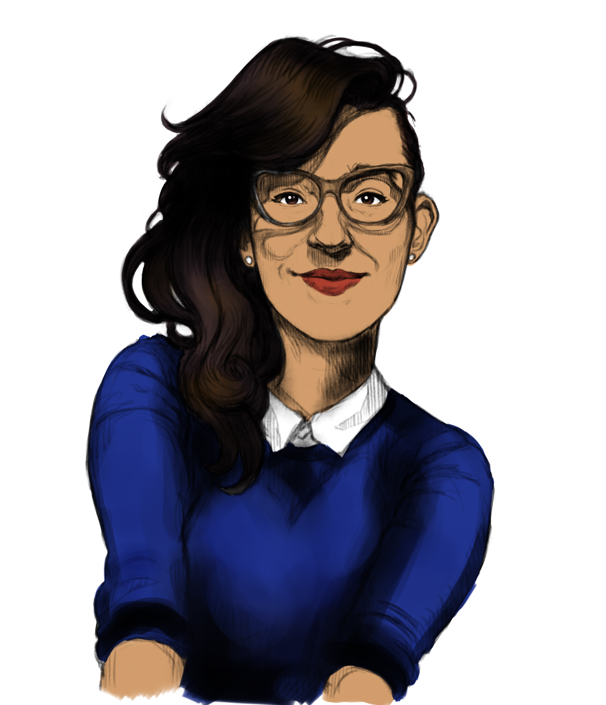
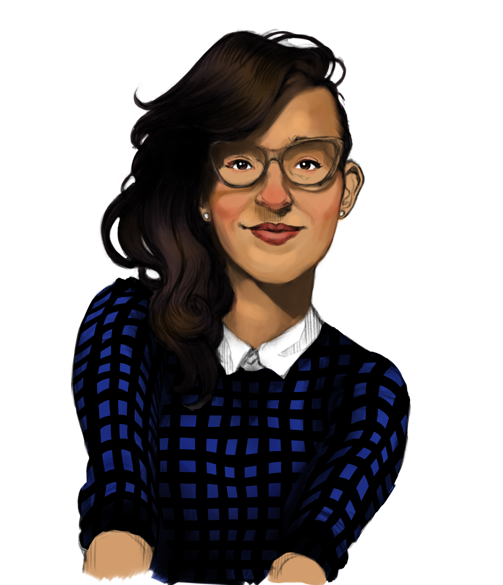
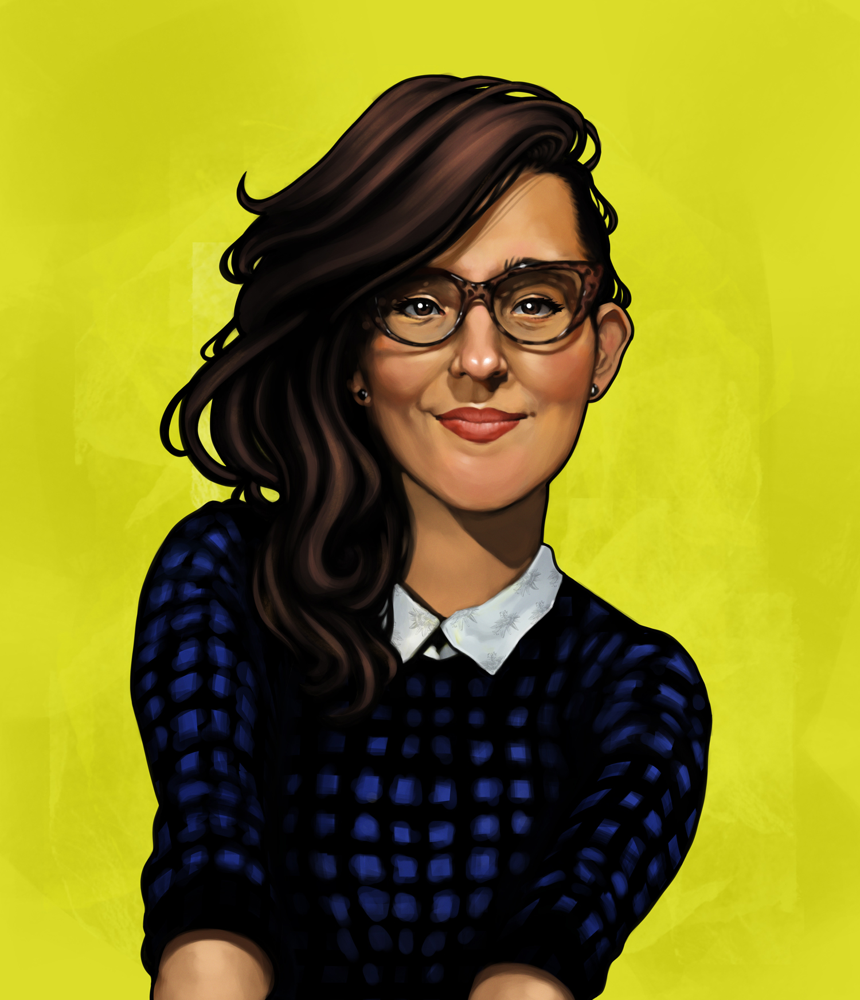

Pintura digital de Susan con un chaleco azul. He pintado este retrato de mi esposa <3 con Adobe Photoshop, en unas 6-8 horas aproximadamente. Últimamente estoy experimentando mucho para encontrar una técnica con la que me sienta cómodo y obtener mejores resultados en menos tiempo, ya que tiendo a complicar y repasar demasiado mis dibujos.

## Proceso

Boceto inicial de la ilustración

Con el boceto en una capa separada, empiezo a pintar algunos colores planos con el modo de multiplicar de Photoshop, para poder seguir mirando las líneas mientras hago esto.

Utilizando algunas referencias para ver las zonas de luces y sombras, empiezo a degradar los colores con un pincel grande para evitar entrar en muchos detalles por ahora. También añado algunos colores diferentes para dar algo de "vida" al cuadro (como el rojo en las mejillas, algunos azules cerca de los ojos y el amarillo en la frente.

Sigo trabajando en el renderizado ahora con un pincel más pequeño

Ahora es el momento de los detalles, añadiendo algunos tonos más oscuros para afinar algunos bordes y puntos blancos para las zonas más brillantes (ojos, gafas, labios, etc.).

Este es el resultado final, estoy bastante contento con él. Voy a seguir intentando hacer retratos digitales similares para seguir mejorando mi técnica y familiaridad con los pinceles.