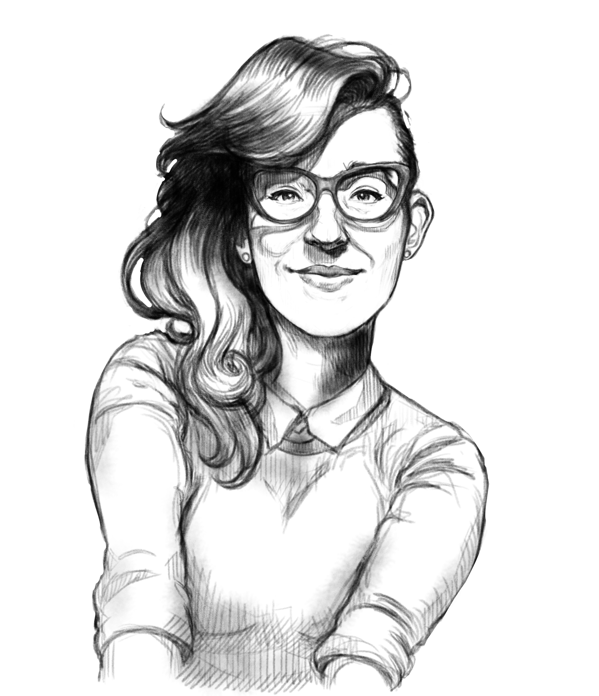
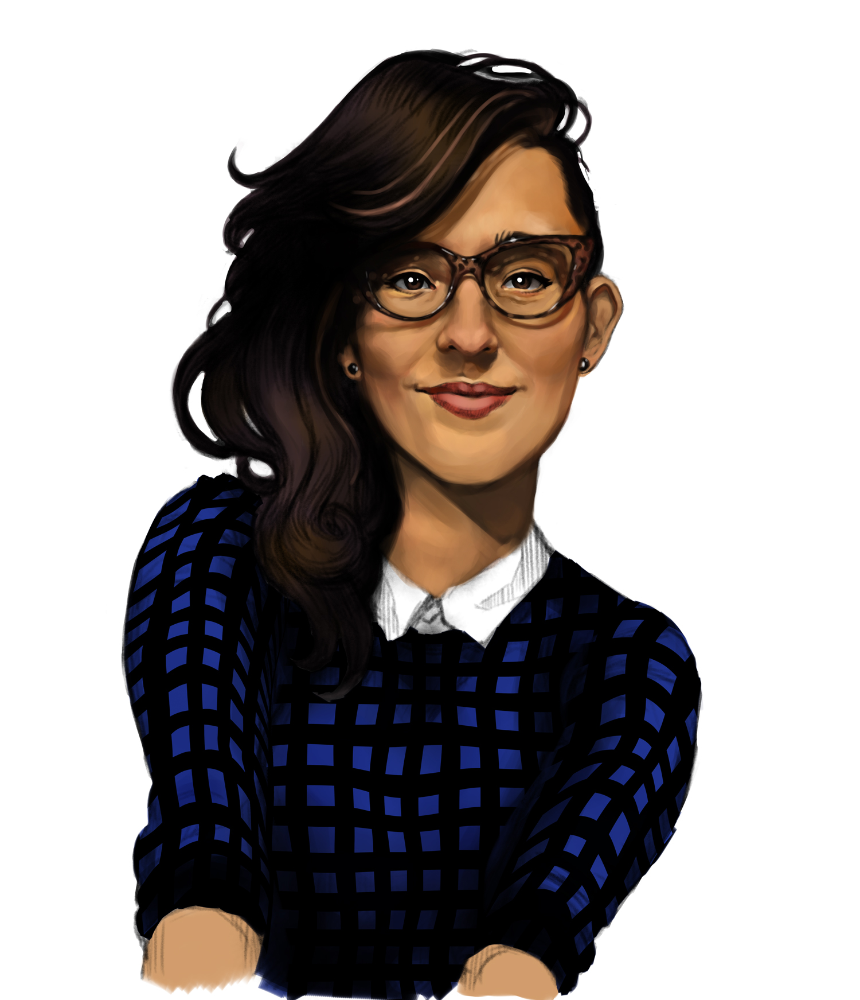

Digital painting of Susan con chaleco azul (Susan with blue sweater). I painted this portrait of my wife <3 with Adobe Photoshop, in about 6-8 hours approximately. I have been experimenting a lot lately in order to find a technique that I feel comfortable with and get better results in less time, as I tend to overcomplicate and rework my drawings too much.

## Process

Initial sketch of the illustration

With the sketch in a separated layer, I start painting some flat colors with the multiply mode of Photoshop, so I can keep looking at the lines while I do this.

Using some references to see the zones of lights and shadows, I start a basic rendering of the colors with a big brush to avoid getting into many details for now. I also add some different colors to give some "life" to the painting (such as red in the cheeks, some blues near the eyes and yellow in the forehead.

I keep working on the rendering now with an smaller brush

Now it's time for details, adding some darker tones to sharp some edges and white spots for the brightest areas (eyes, glasses, lips, etc.).

This is the final result, I'm pretty happy with it. I'm going to keep trying doing similar digital portraits to keep improving my technique and familiarity with the brushes.