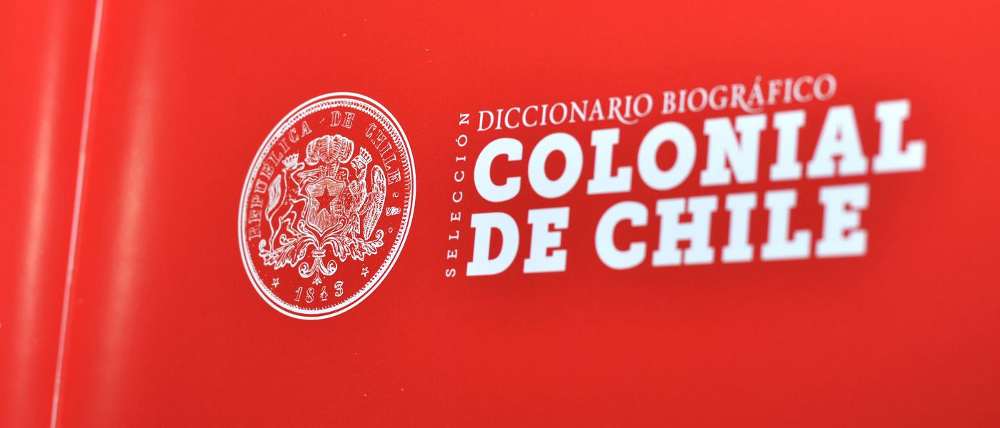
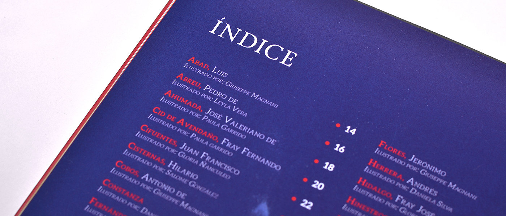

Academic project that consisted in the reinterpretation through editorial design and illustration, of the "Diccionario Biográfico Colonial de Chile" (Biographical Dictionary of Colonial Chile), written in 1906 by the historian Jose Toribio Medina. The dictionary is a compendium of biographical details of rulers, soldiers, priests, writers, among other characters who populated the chilean territory during the colonial period.

Each student had to illustrate six characters using the small biography as inspiration.The teacher gave us a visual reference to maintain a consistent style throughout the book. He chose Agata Dudek: https://www.behance.net/dudu. Also, each student had to design the layout of the book.

My layout was chosen along with 4 of my illustrations for the final version of the book.

BOOK PRINT DETAILS:
Paperback. 17 x 13 cm.
84 pages printed in four colours.
500 printed and free distributed books
The original text is in the public domain: http://www.memoriachilena.cl/602/w3-article-8209.html

*Book cover designed by Gloria Ñanculeo: https://www.behance.net/gnanculeo*

The book was selected for the final presentation of students projects in the Sixth Meeting of the Latin American Biennial of Design (BID) in Spain, in the category "Graphic and Visual Communication".

The link of the project on the site of the biennial: https://goo.gl/RhwqjF

